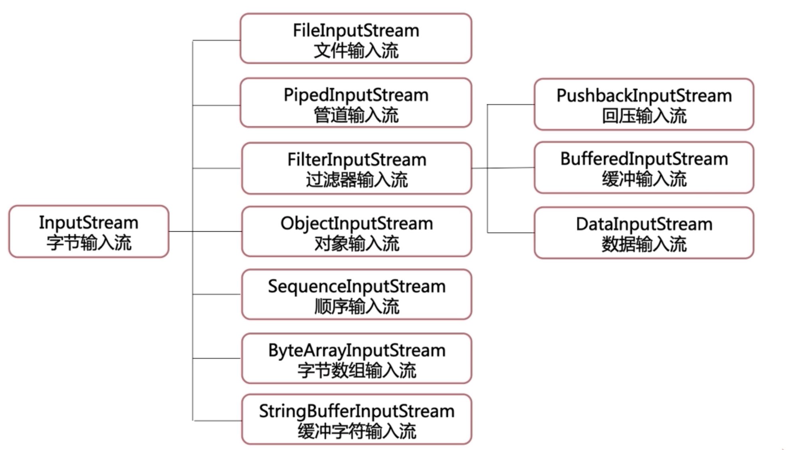
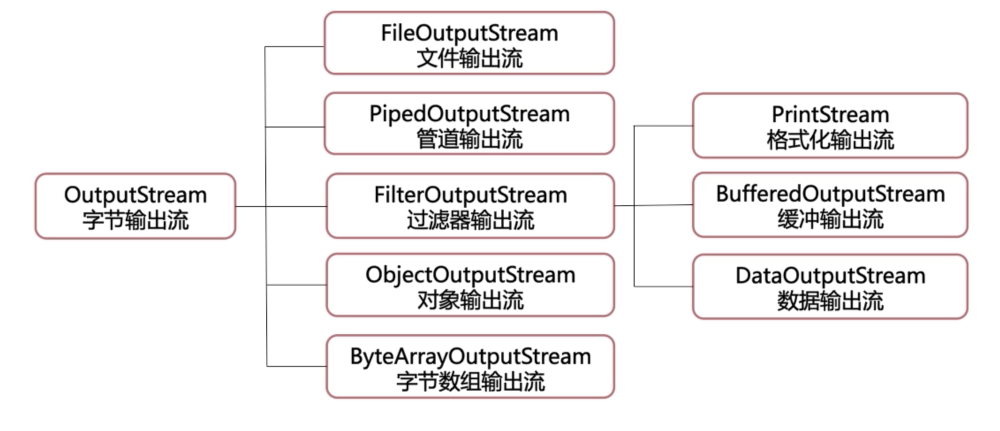
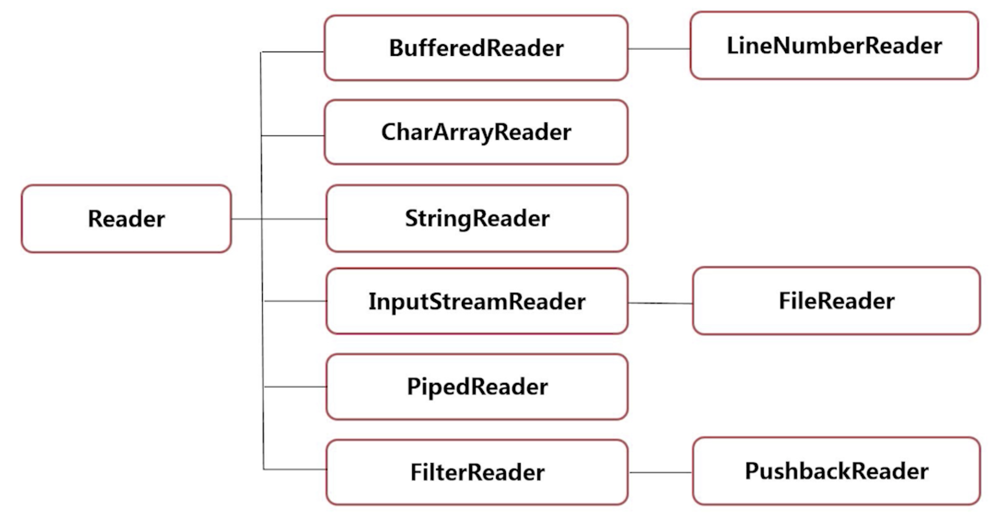

# java io流

## java处理文件
``` java
public static void main(String[] args) {
        File file1 = new File("/Users/ayooo/Desktop/note/java/repos/java/io");
        // 判断是否是文件夹
        System.out.println(file1.isDirectory());
        // 判断是否是文件
        System.out.println(file1.isFile());

        // 通过相对路径创建文件，会创建在项目的根目录
        File file2 = new File("test.txt");

        // 判断当前文件使用的是否为绝对路径
        System.out.println(file2.isAbsolute());

        // 返回当前默认路径地址
        System.out.println(file2.getPath());

        // 返回绝对路径地址
        System.out.println(file2.getAbsolutePath());

        // 获取文件名字
        System.out.println(file2.getName());

        // 如果file2不存在，创建file2
        if (!file2.exists()) {
            try {
                file2.createNewFile();
            } catch (IOException e) {
                e.printStackTrace();
            }
        }

    }
```

## java字节流
> 字节流会把数据解析成二进制流进行数据的传输

* 字节输入流 InputStream


* 字节输出流 OutputStream


### InputStream
``` java
public static void main(String[] args) {
   try {
       // 读取文件的类型
       FileInputStream fileInputStream = new FileInputStream("test.txt");

       // 使用方法一读取数据
       int n = 0;
       // 使用read方法读取文件的下一个字符 返回int
       while((n = fileInputStream.read()) != -1) {
           System.out.print((char) n);
       }

       // 使用方法二读取
       byte[] beyte = new byte[100];
       // 传递一个byte数组 返回读取后的数组
       fileInputStream.read(beyte);
       System.out.println(new String(beyte));

       fileInputStream.close();
   } catch (FileNotFoundException e) {
       e.printStackTrace();
   } catch (IOException e) {
       e.printStackTrace();
   }
}
```

### OutputStream
``` java
// copy 图片
public static void main(String[] args) {
    try {
        FileInputStream fileInputStream = new FileInputStream("/Users/ayooo/Desktop/note/java/img/集合.png");
        FileOutputStream fileOutputStream = new FileOutputStream("image-test.png");

        // 创建接受数组长度的变量
        int n = 0;
        // 创建接受数据的数组
        byte[] bytes = new byte[1024];
        // 循环接受数组
        while ((n = fileInputStream.read(bytes)) != -1) {
            // 循环接受到的数据写入到文件当中
            fileOutputStream.write(bytes, 0, n);
        }

        fileInputStream.close();
        fileOutputStream.close();
    } catch (FileNotFoundException e) {
        e.printStackTrace();
    } catch (IOException e) {
        e.printStackTrace();
    }
}
```

### 使用更快的BufferedStream
``` java
public static void main(String[] args) {
    try {
        FileOutputStream fileOutputStream = new FileOutputStream("test.txt");
        FileInputStream fileInputStream = new FileInputStream("test.txt");
        BufferedInputStream bufferedInputStream = new BufferedInputStream(fileInputStream);
        BufferedOutputStream bufferedOutputStream = new BufferedOutputStream(fileOutputStream);

        // 使用write方法把'a'写入缓冲区 当缓冲区写入容量达到20b时自动写入到文件中
        bufferedOutputStream.write('a');
        System.out.println(bufferedInputStream.read());

        // 可以通过flush() close() 方法自动将未写入的数据写入到文件中
        bufferedOutputStream.flush();

        bufferedInputStream.close();
        bufferedOutputStream.close();
        fileInputStream.close();
        fileOutputStream.close();
    } catch (FileNotFoundException e) {
        e.printStackTrace();
    } catch (IOException e) {
        e.printStackTrace();
    }
}
```

## java字符流
> 字符流在传输上以字符的格式传输

* Writer

* Reader


``` java
public static void main(String[] args) {
    try {
        FileInputStream inputStream = new FileInputStream("test.txt");
        FileOutputStream outputStream = new FileOutputStream("test-copy.txt");
        // 设置编码为GBK
        InputStreamReader streamReader = new InputStreamReader(inputStream);
        // 使用缓冲区BufferedReader
        BufferedReader bufferedReader = new BufferedReader(streamReader);

        OutputStreamWriter streamWriter = new OutputStreamWriter(outputStream);
        // 使用缓冲区BufferedWriter
        BufferedWriter bufferedWriter = new BufferedWriter(streamWriter);

        int next = 0;
        char[] chars = new char[10];
        while ((next = bufferedReader.read(chars)) != -1) {
            System.out.println(new String(chars, 0, next));
            bufferedWriter.write(chars, 0, next);
        }
        // 刷新缓冲区
        bufferedWriter.flush();

        streamReader.close();
        streamWriter.close();
        inputStream.close();
        outputStream.close();
        bufferedReader.close();
        bufferedWriter.close();

    } catch (FileNotFoundException e) {
        e.printStackTrace();
    } catch (IOException e) {
        e.printStackTrace();
    }
}
```

## 对象序列化
序列化的实现：
* 创建一个类，继承`Serializable` 接口

* 实例化对象

* 将对象写入文件

* 从文件当中读取对象的信息

对象的序列化设计的类：
* 对象输入流： ObjectInputStream

* 对象输出流： ObjectOutputStream

``` java
public static void main(String[] args) {
    Goods phone = new Goods(1, "phone", 2000);
    Goods book = new Goods(2, "book", 100);

    try {
        // 将定义的对象以特殊的格式存储在文件当中
        FileOutputStream outputStream = new FileOutputStream("test.txt");
        ObjectOutputStream objectOutputStream = new ObjectOutputStream(outputStream);
        objectOutputStream.writeObject(phone);
        objectOutputStream.writeObject(book);
        objectOutputStream.flush();

        // 读取文件中的 对象
        FileInputStream inputStream = new FileInputStream("test.txt");
        ObjectInputStream objectInputStream = new ObjectInputStream(inputStream);
        Goods goods = (Goods) objectInputStream.readObject();
        System.out.println(goods);

        inputStream.close();
        objectInputStream.close();
        objectOutputStream.close();
        outputStream.close();
    } catch (FileNotFoundException e) {
        e.printStackTrace();
    } catch (IOException e) {
        e.printStackTrace();
    } catch (ClassNotFoundException e) {
        e.printStackTrace();
    }
}
```
