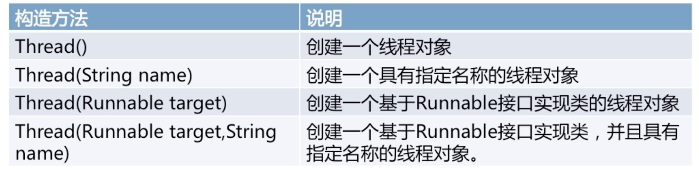
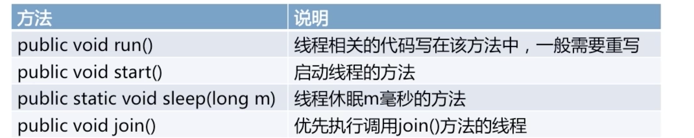
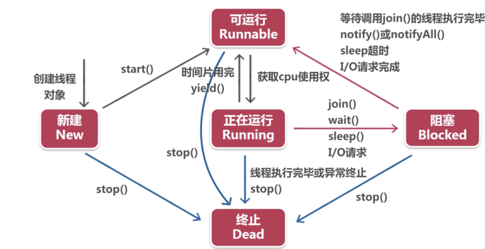

# java 多线程
> 线程的创建：1.创建一个thread类/子类的对象；2.创建一个实现runable接口的类的对象。

##  thread类
>  thread是一个线程类， 位于`java.lang` 包下面。

* thread类的构造方法：
  

* thread类的常用方法：
  

``` java
class MyThread extends Thread {
    // 重写run方法
    @Override
    public void run() {
        // 通过父类中的getName方法返回线程名称
        System.out.println(getName() + " 线程正在执行");
    }
}

public class ThreadTest {
    public static void main(String[] args) {
        MyThread myThread = new MyThread();
        // 使用实例调用start来执行线程中的run方法
        myThread.start();// -> 只能执行一次
    }
}
```
线程的运行是随机的， 没有先后顺序
``` java
class MyThread extends Thread {
    // 重写构造函数 设置线程名称
    public MyThread(String name) {
        super(name);
    }

    // int i = 0; 当把i定义成成员变量的时候 线程之间的i是共享的

    // 重写run方法
    @Override
    public void run() {
        // 通过父类中的getName方法返回线程名称
        for (int i = 0; i < 3; i ++)
            System.out.println(getName() + " 线程正在执行 *" + i);
    }
}

public class ThreadTest {
    public static void main(String[] args) {
        MyThread myThread1 = new MyThread("thread1");
        MyThread myThread2 = new MyThread("thread2");
        // 使用实例调用start来执行线程中的run方法
        myThread1.start();
        myThread2.start();
    }
}
```

## Runable接口
* 只有一个`run()` 方法

* Runable是java中用以实现线程的接口

* 任何实现线程的类都必须实现Runable接口

### 使用Runable接口的场景
* java中不支持多继承，所以其他类的子类只能通过实现Runable接口来实现多线程

* 在不需要重写Thread类中的其他方法时（除了`run()`方法），Runable更优势

``` java
class PrintRunable implements Runnable {
    @Override
    public void run() {
        // 使用 Thread.currentThread().getName方法获取当前线程名称
        System.out.println(Thread.currentThread().getName() + " 正在运行");
    }
}
public class RunableTest {
    public static void main(String[] args) {
        // 创建一个runable实例
        PrintRunable pr = new PrintRunable();
        // 通过Thread传递的方式创建线程
        Thread thread = new Thread(pr);
        thread.start();
    }
}
```

### 线程状态
* 新建状态（new）

* 可运行状态（Runable）
* 正在运行状态 （Running）

* 阻塞状态 （blocked）

* 终止状态 （dead）

#### 线程的生命周期

#### sleep线程休眠
Thread类中的静态方法：
`public static void sleep(long millis)`
``` java
@Override
// sleep 方法休眠当前线程 不影响其他正在执行的线程
public void run() {
    System.out.println(Thread.currentThread().getName() + " 正在运行");
    try {
        Thread.sleep(100);
    } catch (InterruptedException e) {
        e.printStackTrace();
    }
}
```

#### join方法抢先执行
``` java
public static void main(String[] args) {
    PrintRunable pr = new PrintRunable();
    Thread thread1 = new Thread(pr);
    thread1.start();
    // 线程一会被首先执行
    try {
      // join（long millis） 可以接受参数 限定join的方法执行的最长时间
      // 若超过限定时间会中断线程让其他线程执行
        thread1.join();
    } catch (InterruptedException e) {
        e.printStackTrace();
    }

    PrintRunable pr1 = new PrintRunable();
    Thread thread2 = new Thread(pr1);
    thread2.start();
}
```

#### 线程优先级
* 通过优先级常量定义优先级
  * MAX_PRIORITY: 表示线程的最大优先级10
  * NORM_PRIORITY: 表示线程的默认优先级5（主线程的优先级为5）
  * MIN_PRIORITY: 表示线程的最小优先级1

``` java
class PrintRunable implements Runnable {
    @Override
    public void run() {
        for (int i = 0; i < 10; i ++) {
            System.out.println(Thread.currentThread().getName() + "： " +
                    Thread.currentThread().getPriority() + " *" + i);
        }
    }
}
public class RunableTest {
    public static void main(String[] args) {
        // 通过 Thread.currentThread().getPriority() 方法查看当前进程的优先级
        System.out.println(Thread.currentThread().getPriority());
        PrintRunable pr1 = new PrintRunable();
        PrintRunable pr2 = new PrintRunable();

        Thread thread1 = new Thread(pr1);
        Thread thread2 = new Thread(pr2);

        // 通过调用 setPriority方法设置优先级别
        thread1.setPriority(Thread.MAX_PRIORITY);
        thread2.setPriority(Thread.MIN_PRIORITY);

        thread1.start();
        thread2.start();

    }
}
```

### 线程同步
> 使用`synchronized`进行线程同步， `synchronized`定义的方法或者代码块内的代码会执行完毕后再切换线程，避免异步操作带来的负面影响。

``` java
public static synchronized void save() {
  // ... 同步执行
}
public synchronized void save() {
  // ... 同步执行
}
synchronized(bank) {

}
```

### 线程间的通信
* wait() 方法： 中断方法，使线程等待
* notify() 方法： 唤醒处于等待的方法，结束等待
* notifyAll() 方法： 唤醒所有处于等待的方法

``` java
public class Queue {
    private int product = 0;
    private boolean flag = false;

    public int getProduct() {
        return product;
    }

    public void setProduct(int product) {
        this.product = product;
    }

    public synchronized void produce() {
        if (!flag) {
            this.product = this.product + 1;
            System.out.println("生产" + product);
            notifyAll();
            flag = true;
        }
        try {
            wait();
        } catch (InterruptedException e) {
            e.printStackTrace();
        }
    }

    public synchronized int consume() {
        if (!flag) {
            try {
                wait();
            } catch (InterruptedException e) {
                e.printStackTrace();
            }
        }
        System.out.println("消费" + product);
        notifyAll();
        flag = false;
        return product;
    }
}
```
