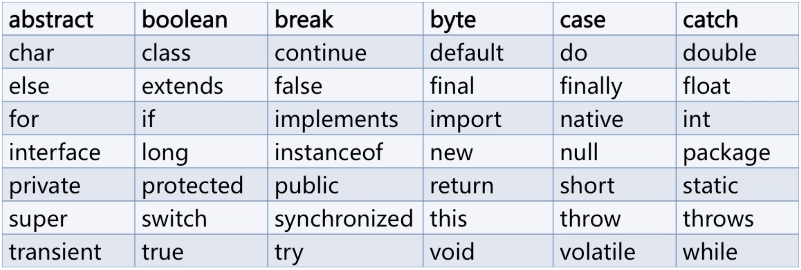

## 一、java常量与变量
### 标识符（类名称）
>java语言中，对于变量、常量、函数、语句块也有名字，我们统统成为`标识符`；

* 标识符可以由字母、数字、下划线和美元符组成，不能以数组开头。

* 标识符严格区分大小写。

* 标识符不能是java中的关键字和保留字。

* 标识符命名最好可以反映出其作用。

### 关键字
  >java关键字是电脑里预先定义的，有特别意义的标识符（有时又被称为`保留字`），java关键字对于编译器有特殊的意义，他们用来表示一种特殊的数据类型，或者表示程序的结构等，关键字不能用作变量名、方法名、类名和参数。


### 数据类型
* 引用数据类型
  * 类
  * 接口
  * 数组
  <br/>

* 基本数据类型
  * 整形   （byte short int long）
  * 浮点型 （float double）
  * 字符型 （char）
  * 布尔型 （boolean）

### 基本类型数据转换
&emsp;&emsp;实线箭头代表自动类型转换（反方向只能强制类型转换），虚线箭头表示在自动类型转换时可能会发生精度丢失。


## 二、java运算符
### 自增自减运算符
自增自减运算符中只对一个变量进行运算，所以被称为单目运算符。加减乘除需要对两个变量进行运算，被称为双目运算符。条件运算符（？：）是唯一的三目运算符。


### 运算符的优先级

## 三、java循环结构与选择结构
### switch语句
> switch语句只接收 `char` `int` `short` `byte`类型的数据，在jdk1.6后添加了对于`String`类型的支持。

### break语句
> break语句用于结束当前循环。在多重循环当中，break只会向外跳一层。（break语句可以用在循环当中，也可以用在switch语句当中）

### continue语句
> 结束当前循环的执行，但是继续执行下一次循环。（continue语句只能用在循环结构当中）

## 四、java方法
### 可变参数
java方法中的可变参数:
``` java
public static void main(int a, int... params) {
  /*
  * 可变参数与数组类似， 不能与数组方法重载（int a, int[] params）
  * 可变参数只能位于最后一个参数位置
  */

  // 通过增强型for循环对可变参数 params 进行遍历
  for (int param:params) {
    System.out.println(param);
  }
}
```
注： 当有非可变参数的重载方法时，会优先调用非可变参数方法。<br>
``` java
public static void main(int a, int b) {
  // ... 会优先调用此方法
}
```
### 对象实例化
* 对象的实例化分为两部分：
  * `Cat cat` => 声明对象是在栈中开辟空间

  * `new Cat()` => 实例化的对象是存储在堆中的

  * `Cat cat = new Cat()` => 使用赋值符栈中的变量指向堆中的实例化对象

## 五、面向对象
### 封装
  * 将类的某些信息隐藏在内部，不予许外部访问
  * 通过该类提供的方法实现对于隐藏信息的设置和访问

#### 访问修饰符
  | 访问修饰符  | 访问权限    |
  | :--------:|------------|
  | private   |私有访问权限，只能在类的内部进行访问|
  | 默认       |默认访问权限，可以在所在包的内部进行访问|
  | protected |受保护的访问权限，在默认权限的基础上添加对于其他包的子类内部的访问权限|
  | public    |最高访问权限，在所有包中都能访问|              

#### static 关键字
> static定义的方法又被称为静态成员（方法）或类成员（方法）。static关键字定义的方法或者成员在有实例对象存在时就会一直存在于内存当中，并且每一个实例对象都公用一个静态成员（方法）。

注：为了避免静态成员（方法）被误调用，尽量使用`类名`+`方法名（成员名）`的调用方式。
#### 代码块
###### 1. 在方法中定义代码块：

方法中的代码块是顺序执行的：
``` java
public class Test {
  public void func() {
    {
      // ... do something...
    }
  }
}
```

类中的构造代码块在程序调用时顺序执行，优先于构造方法执行：
``` java
public class Test {
  public Test() {

  }

  {
    // ...do something... 会优先于构造方法执行
  }

  public void func() {

  }
}
```

类中的静态代码块被在虚拟机进行类加载的时候就会被调用（只调用一次）， 所以被首先执行，并且静态代码块不能像构造代码块一样初始化成员变量（因为不被允许访问成员变量）：
``` java
public class Test {
  static{
    // ...do something...
  }

  public void func() {

  }
}
```
在方法内部书写代码块是不允许定义冲突的变量的（在类中允许）
``` java
public class Test {
  public void func() {
    int a;
    {
      // 报错
      int a;
    }
  }
}
```
### 继承
#### 方法重写
> 方法重写，就是一个类继承了另一个类的时候，对父类的方法重新实现。

* 方法重写时可以改变访问修饰符，但是访问修饰符的权限只能大于或等于父类的访问权限。

* 在调用方法时会优先调用子类中的重写方法（包括在父类内部调用的方法）。
* 在创建一个子类对象的时候，也会调用其父类的无参构造方法。


继承的执行顺序：
``` java
public class Cat extends Animal {
  // ...
  public static void main(String[] args) {
    // 在执行实例化操作时，执行流程：
    // 加载Animal类的static变量 -> 执行Animal类中的static方法 ->
    // 加载Cat类中的static变量 -> 执行Cat类中的static方法 ->
    // 进入Cat类中的构造方法（不执行） -> 进入Animal中的无参构造方法并执行 ->
    // 进入Cat类中的构造方法并执行
    Cat cat = new Cat();
  }
}
```

继承中的静态方法：
> 子类中可以继承父类的静态方法，但是不能重写，可以定义自己的静态方法。在父类进行向上转型（多态）时，只能访问到父类的静态方法。

#### super关键字
在子类内部使用`super` 关键字指向父类，只能在构造方法中调用`super()`，并且父类构造方法`super()`只允许在第一行执行，并且不能与this()同时出现；


### 多态

``` java
Animal animal = new Animal("animal", "female", 1);

        // 子类对象 Cat 转型成 父类对象 Animal 的过程叫做向上转型 -> 父类的引用指向子类引用
        Animal cat = new Cat("catty", "male", 1.2);
        Animal dog = new Dog("doggy", "male", 0.6);

        // 可以使用父类中定义的方法
        animal.food();
        cat.food();
        dog.food();

        // 不能使用父类中不存在的方法(子类中自定义的方法)
        // cat.bark();
        // dog.bark();

        System.out.println("-----------------------");

        // 向下转型(只有被向上转型后的对象可以被向下转型成初始的对象)
        Cat cat1 = (Cat) cat;
        cat1.bark();

        System.out.println("------------------------");
```
#### instanceof 语句

``` java
// 使用 instanceof 判断是否是某个对象的实例
if (cat instanceof Cat)
    System.out.println("cat is a Cat");
if (cat instanceof Dog)
    System.out.println("cat is a Dog");
if (cat instanceof Animal)
    System.out.println("cat is a Animal");
```

### 抽象类
使用规则：
1. `abstract` 定义抽象类。

1. 抽象类不能被实例化，只能被继承。

1. 使用 `abstract` 定义的抽象方法，不需要具体实现，需在子类中重写该方法（定义子类也是抽象方法则不需要）。

1. 包含抽象方法的类一定是抽象类。

1. `static final private` 不能用abstract并存。

### interface 接口
> `interface` 在JAVA编程语言中是一个抽象类型，是抽象方法的集合，接口通常以 `interface` 来声明,通过 `implements` 实现，一个类可以实现多个接口。 ！！！接口中存在多态

``` java
// 接口不能与 ‘protected’ 修饰符搭配使用， 定义抽象类不需要写 ‘abstract’
public interface Test() {
  // ... do something...
}
```
#### 接口中定义常量
> 在接口当中除了可以定义抽象类，还可以定义常量

``` java
// 可以不写 static final
public interface Test() {
  public static final int ID = 1;
}
```
#### default关键字和静态方法
> 在jdk1.8后提供了 `default` 关键字定义默认实现方法，和 `static` 关键字定义静态方法。

``` java
public interface Test() {

  // 在实现的方法中如果不重写此方法会默认实现
  default public void do() {
      // .. do something ..
  }

  // 通过 Test.hello()访问此静态方法
  public static void hello() {
    // .. do something ...
  }
}
```

### 接口中的继承
> 在接口中也存在继承， 并且可以继承子多个父接口。

### Object类
> Object是所有类的父类

### 内部类
> Java类中不仅可以定义变量和方法，还可以定义类，这样定义在类内部的类就被称为内部类。根据定义的方式不同，内部类分为静态内部类，成员内部类，局部内部类，匿名内部类四种。

> 为什么要使用内部类？在《Think in java》中有这样一句话：使用内部类最吸引人的原因是：每个内部类都能独立地继承一个（接口的）实现，所以无论外围类是否已经继承了某个（接口的）实现，对于内部类都没有影响。

> 在我们程序设计中有时候会存在一些使用接口很难解决的问题，这个时候我们可以利用内部类提供的、可以继承多个具体的或者抽象的类的能力来解决这些程序设计问题。可以这样说，接口只是解决了部分问题，而内部类使得多重继承的解决方案变得更加完整。

#### 内部类基础
&emsp;&emsp;当我们在创建一个内部类的时候，它无形中就与外围类有了一种联系，依赖于这种联系，它可以无限制地访问外围类的元素。
``` JAVA
public class OuterClass {
    private String name ;
    private int age;

    /**省略getter和setter方法**/

    public class InnerClass{
        public InnerClass(){
            name = "chenssy";
            age = 23;
        }

        public void display(){
            System.out.println("name：" + getName() +"   ;age：" + getAge());
        }
    }

    public static void main(String[] args) {
        OuterClass outerClass = new OuterClass();
        OuterClass.InnerClass innerClass = outerClass.new InnerClass();
        innerClass.display();
    }
}
```

&emsp;&emsp;如果我们需要生成对外部类对象的引用，可以使用OuterClassName.this，这样就能够产生一个正确引用外部类的引用了。当然这点实在编译期就知晓了，没有任何运行时的成本。
``` JAVA
public class OuterClass {
    public void display(){
        System.out.println("OuterClass...");
    }

    public class InnerClass{
        public OuterClass getOuterClass(){
            return OuterClass.this;
        }
    }

    public static void main(String[] args) {
        OuterClass outerClass = new OuterClass();
        OuterClass.InnerClass innerClass = outerClass.new InnerClass();
        innerClass.getOuterClass().display();
    }
}
```
#### 成员内部类
>成员内部类也是最普通的内部类，它是外围类的一个成员，所以他是可以无限制的访问外围类的所有 成员属性和方法，尽管是private的，但是外围类要访问内部类的成员属性和方法则需要通过内部类实例来访问。
>在成员内部类中要注意两点，第一：成员内部类中不能存在任何static的变量和方法；第二：成员内部类是依附于外围类的，所以只有先创建了外围类才能够创建内部类。

``` java
public class OuterClass {
    private String str;

    public void outerDisplay(){
        System.out.println("outerClass...");
    }

    public class InnerClass{
        public void innerDisplay(){
            //使用外围内的属性
            str = "chenssy...";
            System.out.println(str);
            //使用外围内的方法
            outerDisplay();
        }
    }

    /*推荐使用getxxx()来获取成员内部类，尤其是该内部类的构造函数无参数时 */
    public InnerClass getInnerClass(){
        return new InnerClass();
    }

    public static void main(String[] args) {
        OuterClass outer = new OuterClass();
        OuterClass.InnerClass inner = outer.getInnerClass();
        inner.innerDisplay();
    }
}
```

#### 局部内部类
> 有这样一种内部类，它是嵌套在方法和作用于内的，对于这个类的使用主要是应用与解决比较复杂的问题，想创建一个类来辅助我们的解决方案，到那时又不希望这个类是公共可用的，所以就产生了局部内部类，局部内部类和成员内部类一样被编译，只是它的作用域发生了改变，它只能在该方法和属性中被使用，出了该方法和属性就会失效。

``` java
// 定义在方法中的
public class Parcel5 {
    public Destionation destionation(String str){
        class PDestionation implements Destionation{
            private String label;
            private PDestionation(String whereTo){
                label = whereTo;
            }
            public String readLabel(){
                return label;
            }
        }
        return new PDestionation(str);
    }

    public static void main(String[] args) {
        Parcel5 parcel5 = new Parcel5();
        Destionation d = parcel5.destionation("chenssy");
    }
}

// 定义在作用域中的
public class Parcel6 {
    private void internalTracking(boolean b){
        if(b){
            class TrackingSlip{
                private String id;
                TrackingSlip(String s) {
                    id = s;
                }
                String getSlip(){
                    return id;
                }
            }
            TrackingSlip ts = new TrackingSlip("chenssy");
            String string = ts.getSlip();
        }
    }

    public void track(){
        internalTracking(true);
    }

    public static void main(String[] args) {
        Parcel6 parcel6 = new Parcel6();
        parcel6.track();
    }
}
```

#### 匿名内部类
``` java
button2.addActionListener(  
                new ActionListener(){  
                    public void actionPerformed(ActionEvent e) {  
                        System.out.println("你按了按钮二");  
                    }  
                });
```
#### 静态内部类
> 定义在类内部的静态类，就是静态内部类。静态内部类可以访问外部类的所有静态方法和变量。

``` JAVA
public class Out {
    private static int a;
    private int b;

    public static class Inner {
        /* 在静态内部类中可以存在静态成员 */
        public static String _name1 = "chenssy_static";

        public void print() {
            System.out.println(a);
        }
    }
}

// 通过 类名.方法名访问静态内部类
Out.Inner inner = new Out.Inner();
inner.print();
```
##### Object.equals()
>是比较两个对象是否指向都一块内存。但是String对象中重写了equals方法判断两个字符串的值是否相等。

``` java
Cat cat = new Cat("1");
Cat cat2 = new Cat("1");
boolean flag = (cat == cat2); // false

String str1 = new String("1");
String str2 = new String("1");
flag = (str1 == str2); // false

String str3 = "1";
String str4 = "1";
flag = (str3 == str4); // true
```

当想比较两个对象的值是否相等时，可通过重写子对象的`equals`方法进行比较。

### final关键字
修饰类：
``` java
// final关键字在修饰类时限制类不能被 ‘继承’
public final class Test() {
   // do something ...
}
```
修饰成员方法：
``` java
public class Test() {
  // 在修饰成员方法时限制方法不能被 ‘重写’
  public final void test() {
    // do something...
  }
}
```
修饰成员变量：
``` java
public class Test() {
  // 在修饰成员变量时，只能在构造函数（或构造块）中进行值得初始化
  private final String name;

  {
    name = "name";
  }

  public Test() {
    name = "name";
  }
}
```
修饰静态变量：
``` java
public class Test() {
  // 在修饰静态变量和方法时，声明不能更改的常量和方法
  public final static int TEST_ID = 1;

  public final static int GET_TEST_ID() {
    return TEST_ID;
  }
}
```
修饰变量：
``` java
public class Test() {
  // 在修饰基本类型变量时定义常量，当修饰的变量是引用类型时，限制不能更改内存地址。
  public static void main(String[] args) {
    final Animal animal = new Animal();

    // animal = new Animal() 报错
    animal.setName("2"); // 不报错
  }
}
```
### java注解
* 按照运行机制分
  * 源码注解 ：只在源码中存在，编译后不存在。（@Override）
  * 编译时注解 ：编译后依然存在。
  * 运行时注解 ：在运行时依然起作用的注解，甚至影响逻辑的运行。 （@Autowire）


## 六、java设计模式
### 单例模式
> 使用场景：
* 创建对象时占用内存过多，但是同时又需要该例对象的创建。
* 对系统内的资源要求统一的读写，如： 读写配置信息。
* 当多个实例存在时就可能会引起逻辑错误，如： 代码生成器。

``` java
public class Singleton {
  // 1. 创建私有构造方法
  private Singleton() {}
  // 2. 创建该类的私有静态实例
  private static Singleton instance = new Singleton();
  // 3. 创建共有的静态方法返回实例对象
  public static Singleton getInstance() {
    return instance;
  }
}
```
``` java
public class Singleton {
  // 1. 创建私有构造方法
  private Singleton() {}
  // 2. 创建该类的私有静态实例
  private static Singleton instance = null;
  // 3. 创建共有的静态方法返回实例对象
  public static Singleton getInstance() {
    if (instance == null)
      instance = new Singleton();
    return instance;
  }
}
```
