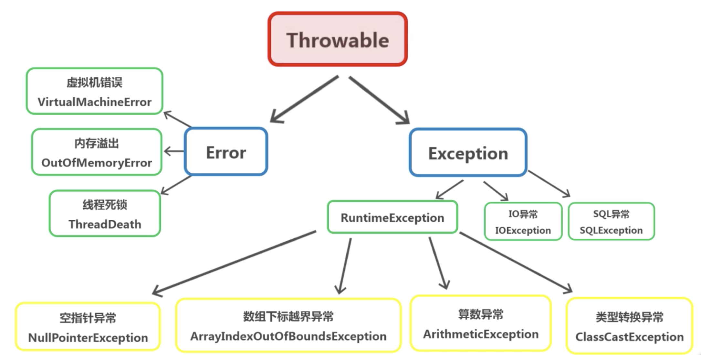
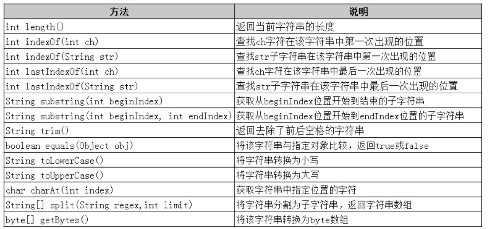
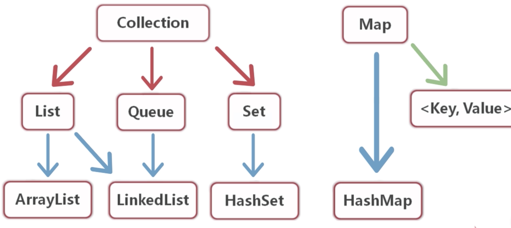
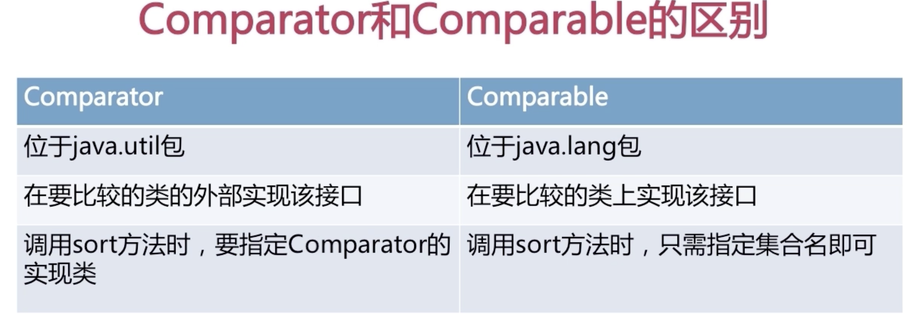

## java异常处理
常见异常类型：
对于检查时异常（checked exception），必须进行异常处理。



### try catch finally 语句块的使用
``` java
public class Test {
    public static void main(String[] args) {
        Scanner scanner = new Scanner(System.in);
        System.out.println("start=========");

        try{
            System.out.println("输入第一个数");
            int one = scanner.nextInt();
            System.out.println("输入第二个数");
            int two = scanner.nextInt();

            System.out.println("运算结果：" + (one / two));

        // 处理用户输入0 时的 运算条件异常

            // return 1执行 但是会被finally语句块中的return 1000 替代
//            return 1;
        } catch (ArithmeticException e) {
            // 可以通过 System.exit(1) 方法终止程序运行

            e.printStackTrace();
            System.out.println("an error with arithmetic");

        // 处理用户输入不是int时的 输入匹配异常
        } catch (InputMismatchException e) {
            System.out.println("an error with input");
        } finally {

            // return 1000;
        }

        System.out.println("end===========");
    }
}
```

### throws & throw
> throws在方法的定义时声明该方法要抛出的异常类型。当方法抛出异常后，方法不对这些类型及其子类型的异常进行处理，而是交给调用此方法的方法，由它去处理。

当子类重写父类抛出异常方法时，声明的异常类必须是父类抛出的异常的子类或者同类。不能是父类型抛出的异常类型。

``` java
// 抛出的两个异常都是uncheck异常， 编译器不会强制进行异常处理，
//当抛出的是Exception 或者check异常时， 则必须对方法进行异常处理。
// "当抛出异常时 最好在文档注释当中写清楚情况"
public static void method() throws ArithmeticException, InputMismatchException {
        Scanner scanner = new Scanner(System.in);
        System.out.println("start=========");

        System.out.println("输入第一个数");
        int one = scanner.nextInt();
        System.out.println("输入第二个数");
        int two = scanner.nextInt();

        System.out.println("运算结果：" + (one / two));

        System.out.println("end===========");
    }

    public static void main(String[] args) {
        method();
    }
```

通过抛出异常解决问题（使用`throw`关键字抛出异常）：

``` java
public class Test {
    public static void main(String[] args) {
        try {
            testAge();
        } catch (Throwable e) {
            System.out.println("bye");
        }
    }

    public static boolean ageValidator(int age) {
        if (age > 80 || age < 18)
            return false;
        return true;
    }

// throwable表示当前抛出的异常类 也可以用父类exception
    public static void testAge() throws Throwable {
        Scanner scanner = new Scanner(System.in);
        System.out.print("input your age:");
        int age = scanner.nextInt();
        boolean isOk = ageValidator(age);

        if (isOk)
            System.out.println("welcome");
        else
            throw new Exception("you need live with your family");
    }
}
```

### 自定义异常
> 所谓自定义异常，就是通过定义一个类，来继承 `Throwable` 或是它的子类。

创建一个自定义异常类：
``` java
public class AgeException extends Throwable {
    public AgeException() {
        super("年龄不符合规定");
    }
}

// 对自定义异常进行处理
public class Test {
    public static void main(String[] args) {
        try {
            testAge();
        } catch (AgeException e) {
            System.out.println("bye");
        }
    }

    public static boolean ageValidator(int age) {
        if (age > 80 || age < 18)
            return false;
        return true;
    }

// throwable表示当前抛出的异常类 也可以用父类exception
    public static void testAge() throws AgeException {
        Scanner scanner = new Scanner(System.in);
        System.out.print("input your age:");
        int age = scanner.nextInt();
        boolean isOk = ageValidator(age);

        if (isOk)
            System.out.println("welcome");
        else
            throw new AgeException
    }
}
```

## 二、java包装类
包装类的初始值是null。
### 拆箱和装箱
``` java
  int i = 1;

  // 自动装箱
  Integer integer = i;
  // 手动装箱
  Integer integer1 = new Integer(i);

  // 自动拆箱
  int i1 = integer;
  // 手动拆箱
  int i2 = integer.intValue();
  double d = integer.doubleValue();
  byte b = integer.byteValue();
```

### 字符串和基本数据类型之间的转换
``` java
public static void  main(String[] args) {

  int i = 1;

  // 数值型转换成字符串类型
  String string1= Integer.toString(i);

  // 字符串类型转换为数值型
  // valueOf 方法会先吧字符串转换成包装类 再自动拆箱
  int i1 = Integer.valueOf(string1);
  int i2 = Integer.parseInt(string1);
  boolean b = Boolean.parseBoolean("true");

  System.out.println(i1);
  System.out.println(b);
}
```

### 包装类之间的比较
``` java
Integer v1 = new Integer(100); //  使用new关键字在堆中创建新内存
Integer v2 = new Integer(100);
int i1 = 100;
Integer v3 = 100;
Integer v4 = 100;
Integer v5 = 200;
Integer v6 = 200;

System.out.println(v1 == v2); // false 内存地址不一样
System.out.println(v1 == v3); // false
System.out.println(v3 == v4); // true 赋值在-128 - 127之间会在变量池中定义 调用的时valueOf
System.out.println(i1 == v3); // true 先进行自动拆箱
System.out.println(v5 == v6); // false
```

## 三、java 字符串处理类
### String中的常用方法：


### 字符串类型的存储：
``` java
String str1 = "123";
String str2 = "123";
String str3 = new String("123");
String str4 = new String("123");

// str1 存储在栈中 "123" 存储在常量池中 new String()存储在堆中
System.out.println(str1 == str2); // true
System.out.println(str3 == str4); // false
```

### String类型不可变性
> String类型具有不可变性，所谓的修改变量只是使栈中的变量指向了另一个地址，原字符串并不会被销毁。所以当进行大量的字符串操作时，尽量避免直接使用String类型。

### 字符串StringBuilder
`StringBuilder`(线程不安全但是效率更高) 和 `StringBuffer`（线程安全）

``` java
public static void  main(String[] args) {
  StringBuilder stringBuilder = new StringBuilder("hello");
  stringBuilder.append(" java").append(1);
  System.out.println(stringBuilder); //hello java1

  stringBuilder.delete(0, 5).insert(0, "love");
  System.out.println(stringBuilder);
}
```

## java 集合


### ArrayList
* 底层有数组实现
* 元素有序可以重复
* 可以动态增长
* 元素值可以为null

``` java
// ArrayList的常用方法
public static void main(String[] args) {
  List list = new ArrayList();
  list.add(new Notice());
  list.set(0, new Notice("1"));
  list.add(0, new Notice("2"));
  list.get(0);
  list.remove(0);
  for(int i = 0; i < list.size(); i ++) {
    System.out.print(((Notice)(list.get(i))).getName());
  }
}
```

### Set
#### HashSet
* HashSet是Set的一个重要实现类
* HashSet中的元素无序并且不能重复（允许null值 但只能存在一个null）
* HashSet具有良好的存储和查找性能

``` java
// set的常用方法
public static void main(String[] args) {
  Set set = new HashSet();
  set.add(new Notice());
  set.add(new Notice("2"));
  // 由于set不提供get方法，所以不能用普通for循环遍历
  // 查找数据
  Iterator iterator = set.iterator();
  while(iterator.hasNext()) {
    if ((Notice)(iterator.next())).getName() == "1") {
      // ...
    }
  }

  // 删除数据 TODO使用循环时规定不能删除多条 所以要先set在removeAll
  Set setTemp = new HashSet();
  for(Object item:set) {
    if(item.getName() == "1" || item.getName() == "2")
      setTemp.add(item);
  }
  // 注意返回boolean类型代表是否删除成功
  boolean b = set.removeAll(setTemp);
}

// 虽然set不允许添加相同元素，但是在添加相同属性的对象时，是可以添加进set当中
// 为了避免重复添加 需要重写添加的类中的hashcode和equals方法
public class Notice {
    //  ...

    // equals用来比较在set中筛选的对象是否相等（属性值相等）
    @Override
    public boolean equals(Object o) {
        if (this == o) return true;
        if (!(o instanceof Notice)) return false;

        Notice notice = (Notice) o;

        if (getId() != notice.getId()) return false;
        if (getTitle() != null ? !getTitle().equals(notice.getTitle()) : notice.getTitle() != null) return false;
        if (getCreator() != null ? !getCreator().equals(notice.getCreator()) : notice.getCreator() != null)
            return false;
        return getDate() != null ? getDate().equals(notice.getDate()) : notice.getDate() == null;
    }

    // hashcode方法用于hash表的判断方法（用于分发存储的元素到不同的hash表中方便查询）
    @Override
    public int hashCode() {
        int result = getId();
        result = 31 * result + (getTitle() != null ? getTitle().hashCode() : 0);
        result = 31 * result + (getCreator() != null ? getCreator().hashCode() : 0);
        result = 31 * result + (getDate() != null ? getDate().hashCode() : 0);
        return result;
    }
}
```

### Map
* map当中的值存储格式是键值对

* key-value 以 entry 的对象实例存在
* 可以通过key值快速查找value

* 一个映射不能包含重复的键

* 每个键最多映射一个值

#### HashMap

* 基于哈希表的map接口实现

* 允许键或者值使用null

* key不能重复

* HashMap中的Entry对象是无序排列的

``` java
public static void main(String[] args) {
  Scanner scanner = new Scanner(System.in);
  Map<String, String> map = new HashMap<>();

  int i = 0;
  while (i < 2) {
      i++;
      System.out.print("input key");
      String key1 = scanner.nextLine();
      System.out.println("input value for " + key1);
      String value1 = scanner.nextLine();

      // 当有重复键的时候提醒用户
      if (map.containsKey(key1)) {
          System.out.println("重复键");
          continue;
      }
      map.put(key1, value1);
  }

  // 取出values 返回set类型
  Iterator iterator = map.values().iterator();
  while (iterator.hasNext()) {
      System.out.println(iterator.next());
  }

  // 取出键值对的entry的set集合
  Set<Map.Entry<String, String>> entries = map.entrySet();
  for (Map.Entry<String, String> entry : entries) {
      System.out.println(entry.getKey() + ":" + entry.getValue());
  }

  // 查找 当get（）不存在时 返回null
  String keyStr = scanner.nextLine();
  Set<String> keySet = map.keySet();
  for (String key : keySet) {
      if (key.equals(keyStr)) {
          System.out.println(map.get(key));
          break;
      }
  }
}
```

### 使用comparator 和 comparable 进行集合内类的排序

两者的区别：


实例：
``` java
// 通过comparator实现的
public static void main(String[] args) {
  List<Cat> list = new ArrayList<Cat>();
  list.add(new Cat(1,"n"));
  list.add(new Cat(2, "a"));
  list.add(new Cat(3, "j"));

  Iterator<Cat> iterator = list.iterator();
  while (iterator.hasNext()) {
      System.out.println(iterator.next().getName());
  }
  System.out.println("--------------------------");

  // 按照name 倒叙排列
  list.sort(new CatSortByString());
  Iterator<Cat> iterator1 = list.iterator();
  while (iterator1.hasNext()) {
      System.out.println(iterator1.next().getName());
  }
  System.out.println("--------------------------");
}


// 通过comparator实现的CatSortByString
public class CatSortByString implements Comparator<Cat> {
    // 重写比较方法
    @Override
    public int compare(Cat o1, Cat o2) {
        String name1 = o1.getName();
        String name2 = o2.getName();
        int flag = name2.compareTo(name1);
        return flag;
    }
}

```

``` java
// 通过comparable实现
public class Cat implements Comparable{
    @Override
    public int compareTo(Object o) {
        return this.getId() - ((Cat) o).getId();
    }
}
// 直接用srot方法排序
```

## 三、泛型
在java1.7之后可以在构造方法中省略泛型类型
``` java
List<String> list = new ArrayList<>()
```

### 泛型的传参
> 泛型的传递参数不支持多态，但是支持以下语法：

``` java
// 定义子类
class Father extends People {
  void say() {
    System.out.println("hello");
  }
}
// 在main函数中进行测试
public static void main(String[] args) {
  List<Father> list = new ArrayList<>();
  list.add(new Father());
  allSay(list);
}
// 可以使用extends关键字来实现对于子类的接收
static void allSay(List<? extends People>) {
  Iterator<? extends People> iterator = list.iterator();
}
```

自定义泛型:
``` java
public class PeopleGeneric<T, E> {
    private T key;
    private E value;

    public E getValue() {
        return value;
    }

    public T getKey() {
        return key;
    }

    public void setKey(T key) {
        this.key = key;
    }

    public void setValue(E value) {
        this.value = value;
    }

    public static void main(String[] args) {
        PeopleGeneric<String, Integer> peopleGeneric = new PeopleGeneric<>();
        peopleGeneric.setKey("test");
        peopleGeneric.setValue(1);
    }
}
```

自定义泛型方法：
``` java
class Generic {
  public <T extends Nubmer> void printValue(T num) {
    T number = num;
  }
  public static void main(String[] args) {
    Generic generic = new Generic();
    generic.printValue(1);
  }
}
```
